# AI Interview Simulator — Software Architecture (V1 / MVP)

> **Audience:** This document is written so that two very different readers can use it:
> a non-technical stakeholder who wants to understand *what* we are building and *why*,
> and an engineer who needs to *build* it. Every technical concept is explained from first
> principles using a fixed 6-point structure, and every significant decision is recorded as an
> ADR (Architecture Decision Record).
>
> **Author's note (Principal Architect):** I have deliberately optimized this design for the
> stated MVP goal — *prove the end-to-end interview experience, fast, running locally* — and
> not for hypothetical future scale. Where I make a forward-looking choice, I say so explicitly.

---

## Table of Contents

1. [How to Read This Document](#1-how-to-read-this-document)
2. [Assumptions & Scope Clarifications](#2-assumptions--scope-clarifications)
3. [High-Level System Architecture](#3-high-level-system-architecture)
4. [Core Concept Primer (the building blocks)](#4-core-concept-primer)
5. [Frontend Architecture](#5-frontend-architecture)
6. [Backend Architecture](#6-backend-architecture)
   - 6.1 [Real-Time Communication](#61-real-time-communication)
   - 6.2 [The AI Pipeline](#62-the-ai-pipeline-the-interview-brain)
   - 6.3 [RAG (Retrieval-Augmented Generation)](#63-rag--retrieval-augmented-generation)
   - 6.4 [Background Workers](#64-background-workers)
   - 6.5 [Caching & State](#65-caching--state)
7. [Data Model & Storage](#7-data-model--storage)
8. [End-to-End Sequence Walkthrough](#8-end-to-end-sequence-walkthrough)
9. [Technology Choices (deep dives)](#9-technology-choices-deep-dives)
10. [Architecture Decision Records (ADRs)](#10-architecture-decision-records-adrs)
11. [Non-Functional Concerns](#11-non-functional-concerns)
12. [Risks & Open Questions](#12-risks--open-questions)

---

## 1. How to Read This Document

Every **technical concept** in this document is explained with the same 6 questions:

1. **What is it?**
2. **Why do we need it?**
3. **What problem does it solve?**
4. **How does it work internally?**
5. **How will this project use it?**
6. **Example / analogy** (for a non-technical reader or a learning student).

Every **technology recommendation** is justified with: *Why this choice · Alternatives · Pros · Cons · Why alternatives were rejected.*

Every **major design decision** is captured in [Section 10](#10-architecture-decision-records-adrs) as an ADR: *Decision · Context · Options Considered · Final Choice · Tradeoffs.*

---

## 2. Assumptions & Scope Clarifications

The project overview is clear about the *experience* but silent on several details that materially affect the architecture. Per the instruction "do not assume features that are not described; if something is unclear, explicitly mention your assumptions," here is exactly what I am assuming and why.

| # | Assumption | Why I must assume it | Impact if wrong |
|---|-----------|----------------------|-----------------|
| A1 | **Speech-to-Text (STT) and Text-to-Speech (TTS) are required components.** The spec says "voice conversation" and "speak naturally / listen continuously" but never names STT/TTS. A voice interview is *impossible* without them. | Voice in → text for the LLM; text out → voice for the candidate. | If interview were text-chat-only, the entire real-time audio pipeline would be removed. The spec explicitly says voice, so I treat STT/TTS as in-scope. |
| A2 | **Single-tenant / single concurrent interview per machine is acceptable for V1.** Local LLM + local STT/TTS are resource-heavy. | The spec says "runs locally, small memory footprint." | If high concurrency is needed, we'd need GPU servers or a hosted model — out of MVP scope. |
| A3 | **No production-grade authentication in V1** (a lightweight session/anonymous identifier is enough). The spec never mentions login, accounts, or multi-user. | Keeps MVP simple per the "avoid unnecessary complexity" directive. | Adding auth later is additive (see [§11](#11-non-functional-concerns)). |
| A4 | **"Like Google Meet" refers to the *feel* (a live audio/video room with a participant you talk to), not literal multi-party video conferencing.** There is exactly one human and one AI. | The AI has no camera; it is an audio entity. | If real multi-party video were required, we'd need an SFU media server (LiveKit/mediasoup). We do not. |
| A5 | **The AI interviewer is audio-only (optionally with an animated avatar / waveform).** No AI-generated video face is required for V1. | Nothing in the spec asks for a synthetic video face. | Avatar video (e.g., lip-sync) is a future enhancement. |
| A6 | **Deployment target is a developer/demo machine (single box), possibly with a modest GPU.** "Runs locally" strongly implies this. | Drives the choice of Ollama, faster-whisper, Piper, SQLite, embedded Chroma. | Cloud scale would change DB and model-serving choices. |
| A7 | **Interview length is short (≈5–15 minutes, a handful of questions).** Implied by "MVP, simple." | Keeps conversation-history token counts small and feedback generation cheap. | Long interviews would need history summarization/windowing (designed-for, see [§6.2](#62-the-ai-pipeline-the-interview-brain)). |

I also propose **one addition to the stated stack: Redis** (for session state / conversation buffer / job queue). It is justified in [ADR-008](#adr-008-redis-for-session-state--queue). Everything else stays within the stack named in the overview (Vue, Tailwind, FastAPI, SQLite, Chroma, local LLM).

---

## 3. High-Level System Architecture

### 3.1 The 10,000-foot view

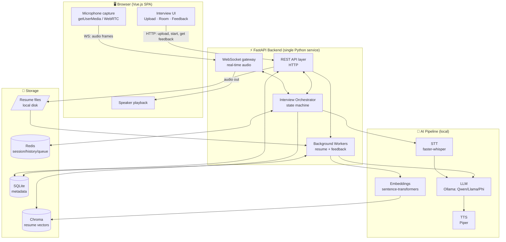

### 3.2 What each major box is responsible for

| Layer | Responsibility |
|-------|---------------|
| **Vue.js SPA** | Capture audio, render the "meeting room," play AI speech, show live transcript, display the final report. |
| **REST API** | Stateless request/response: upload resume, start interview, fetch feedback, fetch status. |
| **WebSocket gateway** | The live, low-latency two-way audio channel during the interview. |
| **Interview Orchestrator** | The conductor. Owns the per-interview state machine (greeting → Q → listen → follow-up → … → close), wires STT→RAG→LLM→TTS, and decides when to end. |
| **Background Workers** | Slow, non-interactive jobs: parse + embed the resume; generate the feedback report after the interview. |
| **AI Pipeline** | The four local models: STT (ears), LLM (brain), TTS (voice), Embeddings (memory indexer). |
| **Storage** | SQLite = facts & metadata; Chroma = searchable resume memory; Redis = hot live state; disk = raw files. |

### 3.3 Three distinct execution paths (a key mental model)

The system has **three timescales**, and recognizing them is the heart of the design:

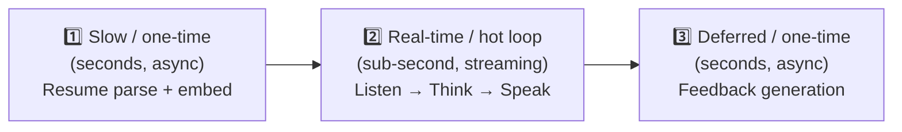

1. **Slow async (before the interview):** parsing/embedding a resume can take a few seconds — the user should *not* stare at a frozen screen. → Background worker.
2. **Real-time hot loop (during the interview):** every extra 100 ms of latency is felt as awkwardness. → Streaming WebSocket + streaming models.
3. **Deferred async (after the interview):** the candidate can wait a few seconds for a report. → Background worker.

This split is the single most important architectural insight and drives nearly every technology choice below.

---

## 4. Core Concept Primer

This section defines the foundational concepts using the 6-point structure. Engineers can skim; non-technical readers should read the analogies.

### 4.1 WebSocket

1. **What is it?** A persistent, two-way communication channel between browser and server that stays open.
2. **Why do we need it?** A normal web request (HTTP) is one question → one answer, then the line hangs up. An interview is a continuous back-and-forth.
3. **What problem does it solve?** It removes the cost and delay of repeatedly opening new connections, and lets the *server* push data to the client at any moment (e.g., the AI starts speaking) without being asked.
4. **How does it work internally?** It begins as a normal HTTP request that asks to "upgrade" the connection. Once upgraded, both sides can send small messages (frames) any time over the same TCP connection until someone closes it.
5. **How will this project use it?** To stream the candidate's microphone audio *up* to the server and the AI's synthesized speech + live transcript/control messages *down* to the browser during the interview.
6. **Analogy:** HTTP is sending letters by post (write, send, wait for a reply, repeat). WebSocket is a phone call you keep open — either person can talk whenever they want.

### 4.2 WebRTC (and why we use only part of it)

1. **What is it?** A browser technology suite for real-time audio/video, including microphone/camera access and peer-to-peer media transport.
2. **Why do we need it?** We need clean access to the microphone and low-latency audio capture in the browser.
3. **What problem does it solve?** Capturing high-quality, echo-cancelled, noise-suppressed microphone audio in a browser (very hard to do well by hand).
4. **How does it work internally?** `getUserMedia()` asks the OS for the mic and returns an audio stream with built-in echo cancellation / noise suppression / auto-gain. WebRTC *can* also create a direct peer connection, but that is for browser-to-browser media.
5. **How will this project use it?** We use the **capture half** of WebRTC (`getUserMedia` + Web Audio API for chunking/VAD) and send audio to the server over **WebSocket**, *not* a full WebRTC peer connection. Rationale in [ADR-002](#adr-002-audio-transport--websocket-pcm-not-full-webrtc-peering). (The spec lists "WebRTC" for Audio/Video — we honor that via `getUserMedia`; we deliberately avoid the heavyweight peering machinery the AI side doesn't need.)
6. **Analogy:** WebRTC is a full telephone exchange. We only need the handset's microphone, not the whole exchange — so we plug that microphone into our own simpler wire (WebSocket).

### 4.3 STT — Speech-to-Text (the "ears")

1. **What is it?** Software that converts spoken audio into written text.
2. **Why do we need it?** The LLM reads text, not sound. We must transcribe the candidate.
3. **What problem does it solve?** Turning a messy audio waveform into the words the candidate said, in near real-time.
4. **How does it work internally?** A neural network (Whisper family) maps audio features to text tokens. "Streaming" variants emit partial words as you speak and finalize on a pause.
5. **How will this project use it?** `faster-whisper` runs locally, transcribing incoming audio chunks; a Voice Activity Detector decides when the candidate has finished a sentence so the AI can respond.
6. **Analogy:** A court stenographer who types everything you say in real time.

### 4.4 TTS — Text-to-Speech (the "voice")

1. **What is it?** Software that converts written text into natural-sounding speech audio.
2. **Why do we need it?** The AI's answer is text; the candidate must *hear* it.
3. **What problem does it solve?** Producing human-like, low-latency speech locally.
4. **How does it work internally?** A neural model converts text → acoustic features → audio waveform. Good engines stream audio sentence-by-sentence so playback starts before the whole answer is generated.
5. **How will this project use it?** `Piper` synthesizes the AI's questions; audio streams back over WebSocket so the candidate hears speech beginning almost immediately.
6. **Analogy:** A narrator reading a script aloud — except it can start reading the first sentence while the rest is still being written.

### 4.5 LLM — Large Language Model (the "brain")

1. **What is it?** A model trained on huge text corpora that predicts and generates language; it can reason, summarize, and converse.
2. **Why do we need it?** It is the interviewer: it asks relevant questions, reacts to answers, asks follow-ups, and later writes the feedback.
3. **What problem does it solve?** Generating context-aware, human-like conversation grounded in the candidate's resume.
4. **How does it work internally?** Given a prompt (system instructions + resume context + conversation so far), it generates the next words one token at a time. "Streaming" emits tokens as they're produced.
5. **How will this project use it?** A small local model served by **Ollama** (e.g., Qwen2.5, Llama 3.2, or Phi-3) drives both the live conversation and the post-interview report.
6. **Analogy:** An extremely well-read improv actor who has skimmed your resume and can keep a natural conversation going on the fly.

### 4.6 Embeddings & Vector Database (the "searchable memory")

1. **What is it?** An *embedding* turns a piece of text into a list of numbers (a vector) that captures its meaning. A *vector database* stores these and finds the most *meaning-similar* ones quickly.
2. **Why do we need it?** A resume can be long; we want to pull only the *relevant* parts into each question instead of stuffing the whole resume into every prompt.
3. **What problem does it solve?** "Find the parts of the resume related to what we're currently talking about" — by meaning, not keywords.
4. **How does it work internally?** An embedding model maps text → vector. Similar meanings → nearby vectors. The vector DB indexes them (e.g., HNSW) so "nearest neighbor" search is fast.
5. **How will this project use it?** During resume processing we chunk the resume, embed each chunk with `sentence-transformers`, and store them in **Chroma**. During the interview we embed the current topic and retrieve the closest resume chunks to ground the next question (this is **RAG**, [§6.3](#63-rag--retrieval-augmented-generation)).
6. **Analogy:** Instead of re-reading an entire book every time, you have sticky notes on every paragraph and instantly flip to the few notes about the topic you're discussing.

### 4.7 RAG — Retrieval-Augmented Generation

1. **What is it?** A pattern where, before the LLM answers, you *retrieve* relevant facts and inject them into the prompt.
2. **Why do we need it?** To keep questions specific and accurate to *this* candidate, and to avoid the model inventing details ("hallucinating") about their experience.
3. **What problem does it solve?** Grounding the AI's questions in the real resume while keeping prompts small.
4. **How does it work internally?** Embed the query → search the vector DB → take the top matches → paste them into the prompt as context → generate.
5. **How will this project use it?** Before each question, retrieve the most relevant resume chunks (e.g., the project the candidate just mentioned) so follow-ups are pointed and personal.
6. **Analogy:** An interviewer who, right before each question, glances at the exact line on your resume relevant to what you just said.

### 4.8 Caching / Hot State

1. **What is it?** Keeping frequently/rapidly accessed data in fast memory instead of on disk.
2. **Why do we need it?** The live conversation state (history, turn, partial transcript) is read/written many times per second.
3. **What problem does it solve?** Avoiding slow disk writes in the real-time loop, and giving us a queue for background jobs.
4. **How does it work internally?** An in-memory store (Redis) keeps key→value data in RAM with optional persistence; also supports lists used as job queues.
5. **How will this project use it?** Redis holds the live conversation buffer + interview state, and acts as the broker for the background job queue. (See [ADR-008](#adr-008-redis-for-session-state--queue).)
6. **Analogy:** Your desk (fast, within arm's reach) versus the filing cabinet across the room (slow, durable). You keep the active interview's papers on the desk.

---

## 5. Frontend Architecture

### 5.1 Overview

The frontend is a **Vue.js Single-Page Application (SPA)** styled with **Tailwind CSS**. It has three screens that map 1:1 to the workflow: **Upload → Interview Room → Feedback Report**.

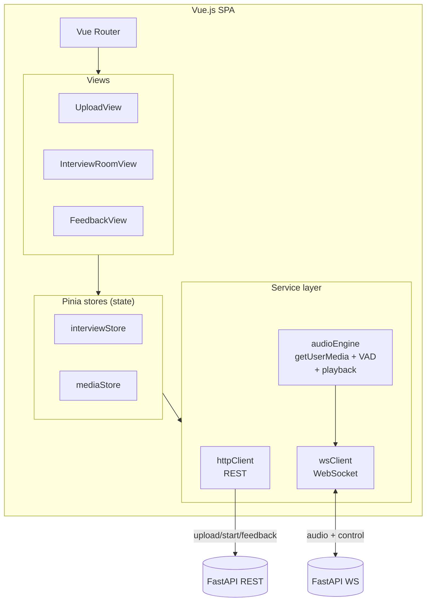

### 5.2 Why this structure

- **SPA + Vue Router:** the three steps are one continuous session; full-page reloads would drop the WebSocket and the mic. An SPA keeps state alive across steps.
- **Pinia (state store):** the interview has meaningful shared state (status, transcript, current turn, connection health) needed by multiple components. A central store avoids prop-drilling and tangled component state.
- **A thin Service layer** isolates the three "hard" concerns — REST, WebSocket, and audio — from UI components, so components stay declarative and testable.

### 5.3 The audio engine (the trickiest part of the frontend)

This is where most frontend bugs live, so it gets explicit design.

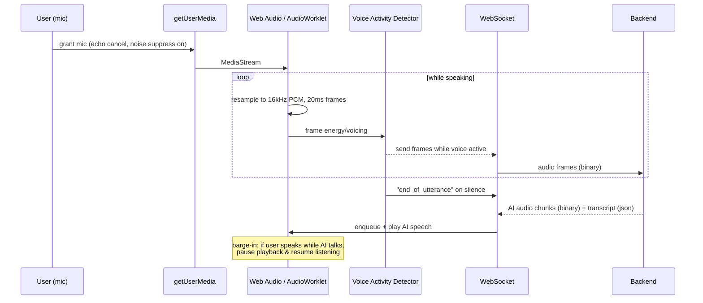

Key responsibilities:
- **Capture:** `getUserMedia({ audio: { echoCancellation, noiseSuppression, autoGainControl } })`.
- **Process:** an `AudioWorklet` resamples to 16 kHz mono PCM and emits fixed frames (low main-thread jank).
- **Client-side VAD (Voice Activity Detection):** detect when the candidate starts/stops talking so we only stream speech and can signal "your turn is over."
- **Playback queue:** buffer incoming AI audio chunks and play seamlessly.
- **Barge-in (nice-to-have for naturalness):** if the candidate starts talking while the AI is speaking, pause AI playback — this is what makes it feel like a real conversation rather than walkie-talkie.

### 5.4 Screen-by-screen

| Screen | Does | Talks to |
|--------|------|----------|
| **UploadView** | Drag/drop PDF/DOCX, show parse progress (polling or WS status), enable "Start Interview" when ready. | `POST /resumes`, `GET /resumes/{id}/status` |
| **InterviewRoomView** | "Meeting room" UI: AI avatar/waveform, mic mute, live transcript captions, end-call button, connection indicator. | `POST /interviews`, then WebSocket |
| **FeedbackView** | Render the report: overall score, communication, technical, resume knowledge, strengths, weaknesses, improvements. | `GET /interviews/{id}/feedback` |

### 5.5 Frontend technology justifications

**Vue.js** — *mandated by the spec*, and a good fit.
- **Why:** gentle learning curve, excellent reactivity for live UIs (transcripts/state), first-class SPA tooling (Vite).
- **Alternatives:** React, Svelte, Angular.
- **Pros:** simple, batteries-included, fast dev loop, great docs.
- **Cons:** smaller ecosystem than React for niche libs.
- **Why alternatives rejected:** spec mandates Vue; no reason to deviate. (React would be equally fine; Angular is heavier than an MVP needs; Svelte is great but smaller community.)

**Tailwind CSS** — *mandated by the spec.*
- **Why:** rapid UI building with utility classes; consistent design without bespoke CSS.
- **Alternatives:** plain CSS, CSS Modules, a component library (Vuetify/PrimeVue).
- **Pros:** fast, no naming bikeshedding, tiny production CSS via purging.
- **Cons:** verbose class lists in markup.
- **Why rejected:** spec mandates Tailwind; for an MVP its speed wins.

**Pinia** (state) and **Vite** (build) — sensible Vue defaults, not mandated but standard; no controversy.

---

## 6. Backend Architecture

The backend is a **single FastAPI (Python) service** that internally hosts: the REST layer, the WebSocket gateway, the Interview Orchestrator, and an in-process (or sidecar) background-worker mechanism. Keeping it one deployable unit is a deliberate MVP choice ([ADR-001](#adr-001-modular-monolith-not-microservices)).

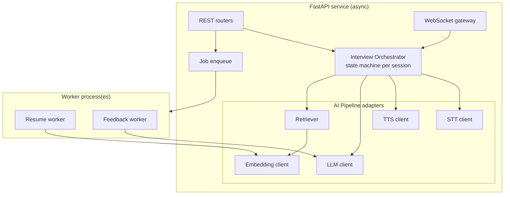

### 6.1 Real-Time Communication

This is the latency-critical core: the **listen → think → speak loop**.

#### The conversation loop

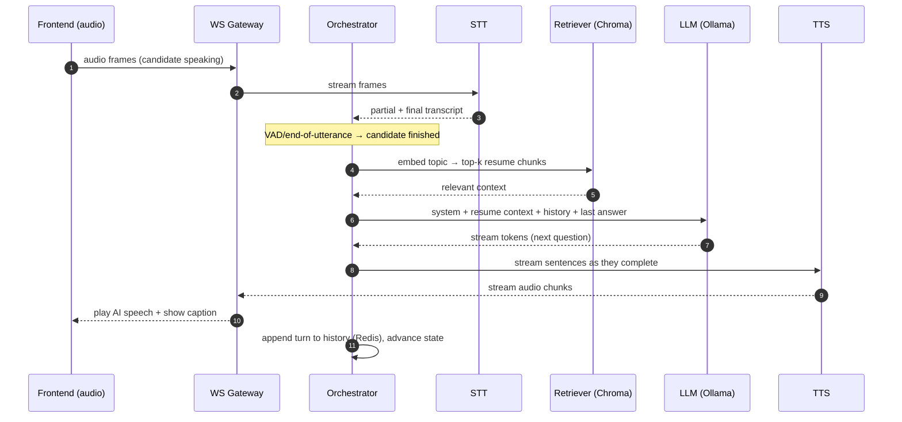

**Latency budget (target, single mid-range GPU or strong CPU):**

| Stage | Target | Technique to hit it |
|-------|--------|---------------------|
| End-of-speech detection | ~200–300 ms | Client + server VAD |
| STT finalization | ~200–500 ms | `faster-whisper` small/base, streaming |
| RAG retrieval | <50 ms | Chroma is in-process, top-k small |
| LLM time-to-first-token | ~300–800 ms | Small model, keep context short, stream |
| TTS time-to-first-audio | ~150–400 ms | `Piper` streams per sentence |
| **Perceived "AI starts talking"** | **~1–2 s** | **Overlap everything via streaming** |

The decisive trick: **pipeline overlap.** We do not wait for the full transcript, then the full LLM answer, then the full audio. We stream: as the LLM finishes sentence 1, TTS starts on it while the LLM writes sentence 2. This is what turns a 4-second robotic gap into a ~1-second natural pause.

#### The Interview Orchestrator (state machine)

The orchestrator is the brain stem. Each interview is a state machine:

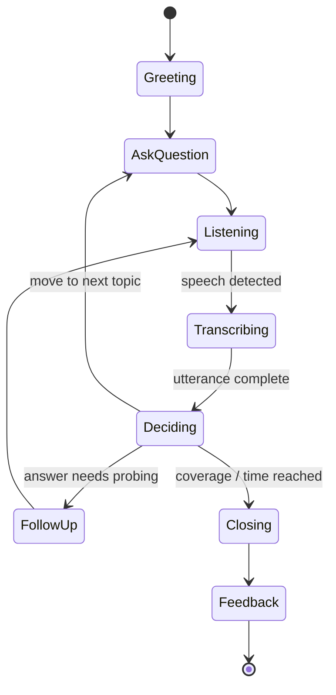

- **Why a state machine?** Conversation flow ("ask one question at a time," "follow up," "end naturally" — all required by the spec) is exactly a set of states and transitions. Encoding it explicitly makes behavior predictable and testable, instead of buried in prompt soup.
- **Ending "naturally":** the orchestrator ends when topic coverage is sufficient OR a soft time limit is hit OR the model signals completion via a structured tool/flag — then it triggers the feedback job.

> **WebSocket — concept recap in context:** here the WebSocket is the single pipe carrying *both* binary audio (both directions) and small JSON control messages (state changes, captions, "AI is speaking," errors). We multiplex by message type.

### 6.2 The AI Pipeline (the "interview brain")

The pipeline is four cooperating local models. Each is wrapped in an **adapter interface** so we can swap implementations without touching the orchestrator (e.g., swap Whisper for a hosted STT later).

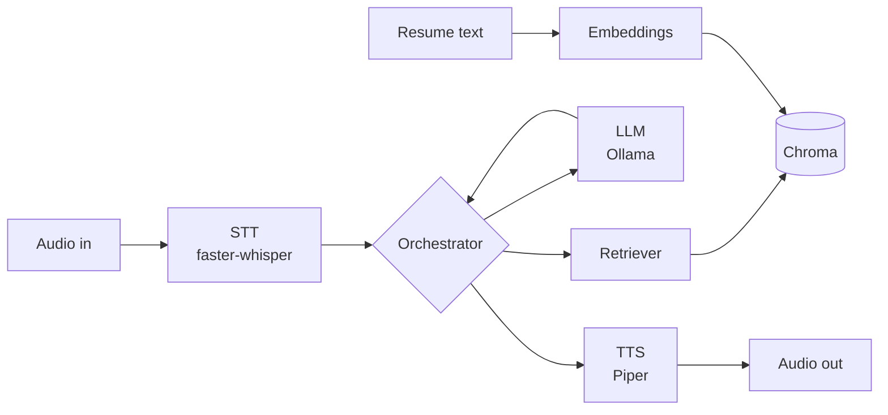

#### Prompt assembly (what the LLM actually sees each turn)

```
[System prompt]  → role, rules: one question at a time, be conversational,
                   probe with follow-ups, use the resume, end gracefully.
[Resume context] → top-k RAG chunks relevant to the current topic.
[Conversation]   → rolling history (recent turns verbatim + older turns summarized).
[Latest answer]  → the candidate's just-transcribed reply.
→ LLM streams the next question / follow-up.
```

- **History management (Assumption A7):** keep the last *N* turns verbatim; if an interview runs long, periodically summarize older turns into a compact "so far" note to control token count and latency.
- **Two LLM jobs, one model:** the *same* local model powers (a) live conversation and (b) the post-interview report — fewer moving parts.

#### LLM serving — technology choice

**Ollama** (serving the local open-source model named in the spec).
- **Why:** dead-simple local model server with an HTTP/streaming API, model management (`pull`/`run`), GPU/CPU auto-detection, and easy model swapping (Qwen, Llama, Phi, Gemma — all the spec's examples).
- **Alternatives:** `llama.cpp` directly, vLLM, LM Studio, Hugging Face Transformers, TGI.
- **Pros:** trivial setup, great DX, streaming, swap models with one line, fits "runs locally / small footprint."
- **Cons:** less raw throughput tuning than vLLM; not built for high-concurrency serving.
- **Why alternatives rejected:** vLLM/TGI are optimized for *server-scale concurrency* we don't have in V1 (A2) and are heavier to operate; raw `llama.cpp` is more setup with no MVP benefit (Ollama wraps it anyway); LM Studio is GUI-oriented, less automatable.

**Model recommendation:** start with **Qwen2.5-3B-Instruct** or **Llama-3.2-3B-Instruct** (strong conversation at small size); fall back to **Phi-3-mini** on weaker hardware. All are quantized (e.g., Q4) for low memory. Final pick should be validated empirically on the target machine.

#### STT — technology choice

**faster-whisper** (CTranslate2 reimplementation of OpenAI Whisper).
- **Why:** local, accurate, 4× faster and lighter than vanilla Whisper, supports streaming-ish chunked decoding and word timestamps; integrated VAD.
- **Alternatives:** `whisper.cpp`, Vosk, browser `SpeechRecognition` API, cloud STT (Deepgram/Google).
- **Pros:** great accuracy/speed/footprint balance, fully local/offline, free.
- **Cons:** still GPU-friendly for best latency; pure-CPU is slower.
- **Why rejected:** browser `SpeechRecognition` is inconsistent across browsers and often cloud-backed (privacy + not "local"); Vosk is lighter but lower accuracy; cloud STT violates the "runs locally" requirement and adds cost/latency/privacy concerns.

#### TTS — technology choice

**Piper** (fast local neural TTS).
- **Why:** very fast, small, runs on CPU, natural-enough voices, streams sentence-by-sentence — ideal for low time-to-first-audio.
- **Alternatives:** Coqui TTS / XTTS, browser `SpeechSynthesis`, cloud TTS (ElevenLabs/Azure).
- **Pros:** local, low latency, low resource use, good quality for MVP.
- **Cons:** voices less expressive than premium cloud (e.g., ElevenLabs).
- **Why rejected:** browser `SpeechSynthesis` quality/voices are inconsistent and uncontrollable; XTTS is higher quality but heavier/slower (hurts the latency budget); cloud TTS breaks "local," adds cost & latency.

#### Embeddings — technology choice

**sentence-transformers** (e.g., `all-MiniLM-L6-v2` or `bge-small`).
- **Why:** small, fast, local, strong semantic quality, trivially integrates with Chroma.
- **Alternatives:** OpenAI embeddings, Instructor-XL, Chroma's default.
- **Pros:** local/offline, fast, free, well-supported.
- **Cons:** lower ceiling than huge hosted embedders (irrelevant for short resumes).
- **Why rejected:** hosted embeddings break "local" + add cost; huge models are overkill for a one-page resume.

### 6.3 RAG — Retrieval-Augmented Generation

#### Indexing (once, at resume upload — background)

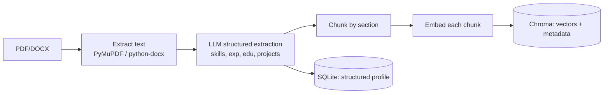

#### Retrieval (each turn, live)

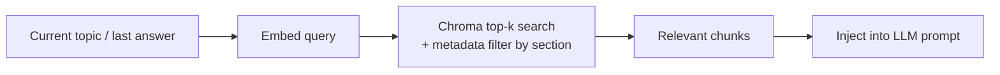

- **Why RAG here even though a resume is short?** Two reasons: (1) it keeps each prompt small and focused → faster LLM responses; (2) it makes follow-ups *specific* ("Tell me more about the Kafka pipeline in Project X") rather than generic. It also reduces hallucinated experience.
- **Chunking strategy:** chunk by resume section (experience entry, project, skill group) with metadata (`section`, `company`, `tech`) so we can both semantically search *and* filter.
- **Hybrid note:** because resumes are small, we can also keep the *full structured profile* (from SQLite) in the system prompt as a compact summary, and use RAG for *depth* on the active topic. Best of both.

#### Vector DB — technology choice

**Chroma** — *mandated by the spec.*
- **Why:** embedded (runs in-process, no separate server), trivial Python API, persistent local storage — perfect for a local MVP.
- **Alternatives:** FAISS, Qdrant, Weaviate, pgvector, Pinecone.
- **Pros:** zero-ops, fast for small data, metadata filtering, local.
- **Cons:** not built for massive multi-tenant scale.
- **Why rejected:** Pinecone is hosted (breaks "local," adds cost); Qdrant/Weaviate are excellent but add a service to run (overkill for MVP, A2); FAISS lacks metadata/persistence niceties out of the box; pgvector needs Postgres (we're on SQLite). For one resume per interview on one box, Chroma is ideal.

### 6.4 Background Workers

#### Concept (6-point)

1. **What is it?** A separate execution path that runs slow tasks outside the request/response cycle.
2. **Why do we need it?** Parsing+embedding a resume and generating a feedback report take seconds — too long to block an HTTP request or the live audio loop.
3. **What problem does it solve?** Keeps the UI responsive ("processing…") and keeps the real-time loop free of heavy work.
4. **How does it work internally?** The API drops a job (an ID + payload) onto a queue; a worker process picks it up, runs it, and writes results back to storage; the frontend polls or is notified.
5. **How will this project use it?** Two jobs: **resume processing** (on upload) and **feedback generation** (on interview end).
6. **Analogy:** At a restaurant, the waiter (API) takes your order and immediately serves other tables; the kitchen (worker) cooks; when ready, the dish is delivered. The waiter never stands frozen at your table while food cooks.

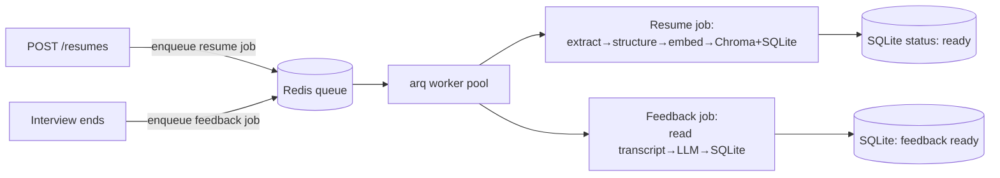

#### Worker technology choice

**arq** (async Redis-based task queue) — *recommended*; Celery is the well-known alternative; FastAPI `BackgroundTasks` is the zero-dependency fallback.
- **Why arq:** natively `async` (matches FastAPI's async stack and our async model clients), lightweight, Redis-backed, simple.
- **Alternatives:** Celery (+Redis/RabbitMQ), Dramatiq, RQ, FastAPI `BackgroundTasks`.
- **Pros:** async-native, minimal config, good fit with Redis we already add.
- **Cons:** smaller community than Celery; fewer advanced features (rate limiting, complex routing).
- **Why rejected:** Celery is powerful but heavyweight and sync-first (awkward with async model calls) — overkill for two job types in an MVP; `BackgroundTasks` runs *inside* the API process, so a crash or restart loses jobs and heavy work competes with the live loop for CPU. arq is the right middle ground.

> **MVP escape hatch:** if we want *zero* extra infra on day one, start with FastAPI `BackgroundTasks`, then graduate to arq. The adapter/queue interface makes this swap trivial. Documented in [ADR-008](#adr-008-redis-for-session-state--queue).

### 6.5 Caching & State

We distinguish **durable facts** (SQLite), **searchable memory** (Chroma), and **hot live state** (Redis).

| Data | Where | Why there |
|------|-------|-----------|
| Resume/interview/feedback metadata, structured profile, final transcript | **SQLite** | Durable, relational, queryable. |
| Resume embeddings | **Chroma** | Semantic search. |
| Live conversation buffer, interview state, partial transcript, "AI speaking" flag | **Redis** | Read/written many times/sec during the live loop; must be fast and must survive a worker handoff. |
| Job queue | **Redis** | Broker for background jobs. |
| Raw resume files | **Local disk** | Cheap blob storage for MVP. |

- **Why not keep live state only in process memory?** It would work for a pure single-process demo, but it (a) dies on restart, (b) can't be shared between the WebSocket process and the feedback worker, and (c) doesn't give us the job queue. Redis solves all three with one dependency — see [ADR-008](#adr-008-redis-for-session-state--queue).
- **Optional LLM/STT caching:** we may cache the greeting and any static prompts; live answers are inherently unique so caching them has little value.

---

## 7. Data Model & Storage

### 7.1 Logical schema (SQLite)

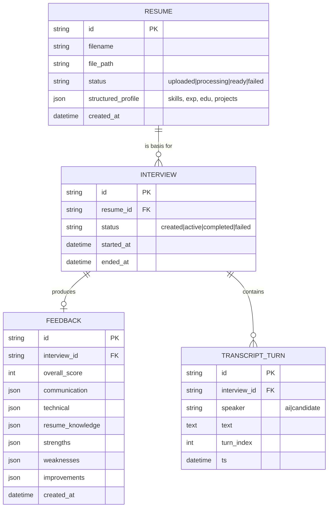

> Embeddings live in **Chroma** (keyed by `resume_id`), not SQLite. The `structured_profile` JSON is the compact summary injected into the system prompt; Chroma holds the chunk-level detail for RAG.

### 7.2 Relational DB — technology choice

**SQLite** — *mandated by the spec.*
- **Why:** zero-config embedded database, a single file, perfect for a local single-box MVP.
- **Alternatives:** PostgreSQL, MySQL.
- **Pros:** no server to run, transactional, reliable, fast for low concurrency.
- **Cons:** weak under high write concurrency; single-writer.
- **Why rejected:** Postgres/MySQL add an ops burden unjustified at MVP scale (A2). **Migration note:** use SQLAlchemy as the ORM so moving to Postgres later is a connection-string change, not a rewrite.

### 7.3 REST API surface (illustrative)

| Method | Path | Purpose |
|--------|------|---------|
| `POST` | `/resumes` | Upload PDF/DOCX → returns `resume_id`, enqueues processing |
| `GET` | `/resumes/{id}/status` | Poll parse/embedding status |
| `POST` | `/interviews` | Create interview from a ready resume → returns `interview_id` |
| `WS` | `/interviews/{id}/stream` | Live audio + control channel |
| `GET` | `/interviews/{id}/feedback` | Fetch the report (after completion) |

---

## 8. End-to-End Sequence Walkthrough

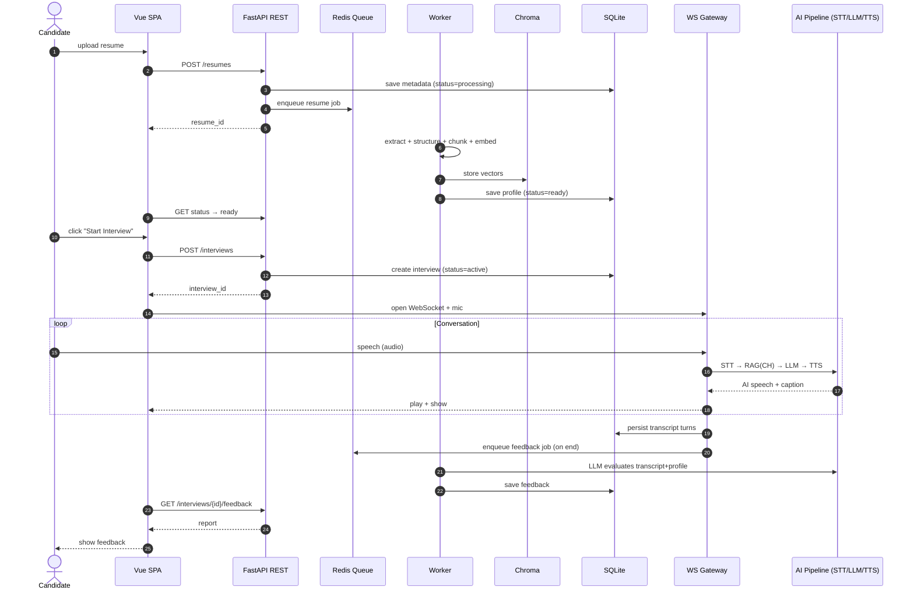

---

## 9. Technology Choices (deep dives)

A consolidated table; detailed justifications appear inline above and in the ADRs.

| Concern | Choice | Top Alternative | One-line reason it won |
|--------|--------|-----------------|------------------------|
| Frontend framework | **Vue.js** *(spec)* | React | Mandated; great reactivity for live UI |
| Styling | **Tailwind** *(spec)* | Component lib | Mandated; fastest to build |
| FE state | **Pinia** | Vuex | Modern Vue default |
| Audio capture | **getUserMedia (WebRTC)** | raw WebRTC peering | Need the mic, not the exchange ([ADR-002](#adr-002-audio-transport--websocket-pcm-not-full-webrtc-peering)) |
| Audio transport | **WebSocket (PCM/Opus)** | WebRTC SFU | Simpler, server is the peer ([ADR-002](#adr-002-audio-transport--websocket-pcm-not-full-webrtc-peering)) |
| Backend framework | **FastAPI** *(spec)* | Django/Flask | Async, native WS, fast |
| Architecture | **Modular monolith** | Microservices | MVP simplicity ([ADR-001](#adr-001-modular-monolith-not-microservices)) |
| LLM serving | **Ollama** | vLLM | Local, simple, swappable ([ADR-005](#adr-005-ollama-for-local-llm-serving)) |
| STT | **faster-whisper** | whisper.cpp / cloud | Local accuracy+speed balance |
| TTS | **Piper** | XTTS / cloud | Local, low latency |
| Embeddings | **sentence-transformers** | OpenAI embeddings | Local, fast, free |
| Vector DB | **Chroma** *(spec)* | Qdrant | Embedded, zero-ops |
| Relational DB | **SQLite** *(spec)* | Postgres | Zero-config, file-based |
| Workers | **arq** | Celery | Async-native, light ([ADR-007](#adr-007-arq-for-background-jobs)) |
| Hot state / queue | **Redis** *(added)* | in-process memory | Shared, durable-ish, queue ([ADR-008](#adr-008-redis-for-session-state--queue)) |
| Conversation control | **Explicit state machine** | prompt-only | Predictable, testable ([ADR-006](#adr-006-orchestrator-as-an-explicit-state-machine)) |

---

## 10. Architecture Decision Records (ADRs)

### ADR-001: Modular monolith, not microservices

- **Decision:** Build the backend as one FastAPI service with clear internal modules (REST, WS, orchestrator, AI adapters), plus a worker process.
- **Context:** MVP, single machine, one concurrent interview (A2/A6), tiny team, "avoid unnecessary complexity."
- **Options considered:** (a) Modular monolith; (b) Microservices (separate STT/LLM/TTS/feedback services); (c) Serverless functions.
- **Final choice:** (a).
- **Tradeoffs:** ✅ Simplest to build/deploy/debug, low latency (no inter-service hops), easy local run. ❌ Scaling one component independently is harder later; a crash affects more. *Mitigation:* clean module boundaries + adapter interfaces make extraction to services straightforward when scale demands it.

### ADR-002: Audio transport — WebSocket PCM, not full WebRTC peering

- **Decision:** Capture audio with `getUserMedia` (WebRTC API) but transport it to the server over **WebSocket** (16 kHz PCM, optionally Opus), and stream AI audio back the same way.
- **Context:** One human ↔ one *server-side* AI. The server is the only "peer." The spec lists WebRTC for Audio/Video and WebSocket for communication. True WebRTC server peering (e.g., `aiortc`) adds ICE/STUN/TURN, SDP negotiation, DTLS — significant complexity.
- **Options considered:** (a) WebSocket audio streaming; (b) `aiortc` server-side WebRTC peer; (c) a media server / SFU (LiveKit, mediasoup).
- **Final choice:** (a), using WebRTC only for capture (honoring the spec's WebRTC mention where it adds value: mic quality, echo cancellation).
- **Tradeoffs:** ✅ Far simpler, no NAT traversal infra, one channel for audio+control, easy backpressure. ❌ Slightly higher latency than raw WebRTC media and we manage jitter/buffering ourselves (acceptable for a 1:1 turn-based interview). ❌ No automatic packet-loss concealment — fine on typical local/broadband. *If* future requirements add real multi-party video, revisit with LiveKit.

### ADR-003: Voice interview requires STT + TTS (treated as in-scope)

- **Decision:** Add local **STT (faster-whisper)** and **TTS (Piper)** as first-class pipeline components.
- **Context:** The spec mandates *voice* conversation but omits STT/TTS (Assumption A1). They are non-optional for the described UX.
- **Options considered:** (a) Local STT/TTS; (b) Cloud STT/TTS; (c) Browser-native Speech APIs.
- **Final choice:** (a).
- **Tradeoffs:** ✅ Fully local (matches "runs locally"), private, free. ❌ Latency/quality depend on hardware; needs decent CPU/GPU. Cloud rejected (breaks "local," cost, privacy); browser APIs rejected (inconsistent, often cloud-backed, low control).

### ADR-004: RAG over Chroma even for a short resume

- **Decision:** Use embeddings + Chroma retrieval to ground each question, *plus* a compact structured-profile summary in the system prompt.
- **Context:** Resumes are short, but prompts must stay small for latency and questions must be specific & non-hallucinated.
- **Options considered:** (a) Stuff entire resume in every prompt; (b) RAG only; (c) Hybrid (summary in prompt + RAG for depth).
- **Final choice:** (c).
- **Tradeoffs:** ✅ Specific follow-ups, small/fast prompts, less hallucination, satisfies the spec's "use resume context." ❌ Slightly more indexing work up front (handled in the resume worker). Full-stuffing rejected (bloats prompt → slower, less focused).

### ADR-005: Ollama for local LLM serving

- **Decision:** Serve the local model via **Ollama**, model configurable (Qwen2.5-3B / Llama-3.2-3B / Phi-3-mini).
- **Context:** "Runs locally, low latency, small footprint, good conversation" (spec §4).
- **Options considered:** Ollama, vLLM, raw llama.cpp, LM Studio, HF Transformers/TGI.
- **Final choice:** Ollama.
- **Tradeoffs:** ✅ Trivial setup, streaming API, one-line model swaps (covers all the spec's example models), CPU/GPU auto. ❌ Not tuned for high concurrency (not needed, A2). vLLM/TGI rejected (server-scale concurrency we lack; heavier ops); raw llama.cpp rejected (more setup, no MVP gain); LM Studio rejected (GUI-first, less automatable).

### ADR-006: Orchestrator as an explicit state machine

- **Decision:** Model interview flow (greeting → ask → listen → decide → follow-up/next/close → feedback) as an explicit server-side state machine.
- **Context:** Spec requires "one question at a time," follow-ups, conversation history, "end naturally." Pure prompt-driven flow is unpredictable and hard to test.
- **Options considered:** (a) Explicit state machine in code; (b) Prompt-only ("let the LLM manage everything"); (c) An agent framework (LangGraph).
- **Final choice:** (a), optionally formalized with LangGraph later.
- **Tradeoffs:** ✅ Predictable, debuggable, testable; clean place to enforce turn-taking and ending logic. ❌ Slightly more code than "just prompt it." Prompt-only rejected (non-deterministic flow, hard to guarantee one-question-at-a-time/ending). Full agent framework deferred (extra dependency not yet justified).

### ADR-007: arq for background jobs

- **Decision:** Use **arq** (async, Redis-backed) for resume processing and feedback generation; allow FastAPI `BackgroundTasks` as a temporary day-1 fallback.
- **Context:** Two slow, async, model-bound jobs that must not block the API or the live loop.
- **Options considered:** arq, Celery, RQ/Dramatiq, FastAPI BackgroundTasks.
- **Final choice:** arq.
- **Tradeoffs:** ✅ Async-native (matches FastAPI + async model clients), light, uses the Redis we already add, survives API restarts. ❌ Smaller ecosystem than Celery. Celery rejected (heavy, sync-first, overkill); BackgroundTasks rejected as the *primary* mechanism (in-process → competes with live loop, loses jobs on crash).

### ADR-008: Redis for session state & queue

- **Decision:** Introduce **Redis** for live conversation/session state and as the job broker. (One addition beyond the named stack.)
- **Context:** Live state is read/written many times per second and must be shared between the WebSocket process and the feedback worker; we also need a durable-enough job queue. The spec's stack lists no cache/queue.
- **Options considered:** (a) Redis; (b) In-process Python memory only; (c) SQLite for everything.
- **Final choice:** (a).
- **Tradeoffs:** ✅ Fast hot state, shareable across processes, survives restarts, doubles as the arq broker — one dependency solves three needs. ❌ One more service to run locally (a single `docker run redis` or brew install). In-process memory rejected (not shared, lost on restart, no queue); SQLite-for-hot-state rejected (disk writes in the real-time loop, single-writer contention).

---

## 11. Non-Functional Concerns

| Concern | MVP stance | Path forward |
|---------|-----------|--------------|
| **Latency** | Streaming pipeline + small models target ~1–2 s perceived turn gap. | GPU, smaller/quantized models, speculative decoding. |
| **Concurrency** | One interview at a time per box (A2). | Move models to a GPU server, add a session/router layer, switch to vLLM. |
| **Auth/Privacy** | Anonymous session ID; data local (A3). | Add OAuth, per-user isolation, encryption at rest. |
| **Resilience** | WS auto-reconnect; jobs in Redis survive API restart. | Retries/dead-letter queue in arq; transcript checkpointing. |
| **Observability** | Structured logs + per-stage latency timers in the pipeline. | Tracing (OpenTelemetry), dashboards. |
| **Portability** | SQLAlchemy + adapter interfaces for every model. | Swap SQLite→Postgres, Chroma→Qdrant, local→hosted models with config. |
| **Cost** | Effectively $0 (all local/open-source). | Hosted models trade cost for scale/quality. |
| **Testing** | Mock the model adapters → deterministic orchestrator tests; record/replay audio fixtures. | Eval harness for question quality + feedback rubric. |

### Suggested module layout (backend)

```
app/
  api/            # REST routers
  ws/             # WebSocket gateway
  orchestrator/   # interview state machine
  pipeline/
    stt.py        # adapter
    tts.py        # adapter
    llm.py        # adapter (Ollama)
    embeddings.py # adapter
    retriever.py  # Chroma RAG
  workers/
    resume.py     # parse → structure → embed
    feedback.py   # transcript → report
  db/             # SQLAlchemy models + Chroma client
  cache/          # Redis client + session state
  core/           # config, logging, prompts
```

---

## 12. Risks & Open Questions

1. **Hardware reality check (highest risk):** the whole real-time UX hinges on the target machine running STT+LLM+TTS within the latency budget. *Action:* benchmark on the real demo machine early; pick model sizes empirically.
2. **Barge-in & echo:** if the candidate uses speakers (not headphones), the mic may pick up the AI's voice. Echo cancellation helps; recommend headphones for V1.
3. **STT errors on accents/jargon:** misheard tech terms can derail follow-ups. *Mitigation:* show live captions so the candidate sees and can self-correct.
4. **"End naturally" definition:** needs a concrete policy (max questions, soft time cap, coverage signal). *Open question for product.*
5. **Feedback objectivity:** a small local model's scoring may be inconsistent. *Mitigation:* a fixed rubric + structured JSON output + low temperature; consider a larger model just for the offline feedback step (it's not latency-bound).
6. **Resume parsing variability:** PDFs vary wildly. *Mitigation:* robust extractor + LLM structuring + a "review extracted profile" step if needed later.

---

### Summary

This architecture delivers the spec's exact MVP — *upload → real-time voice interview → feedback* — as a **single FastAPI modular monolith** with a **streaming real-time pipeline** (getUserMedia → WebSocket → faster-whisper → RAG/Chroma → Ollama LLM → Piper), **two background workers** (resume, feedback) on **arq/Redis**, and **SQLite + Chroma** for storage. Every choice favors local execution, low latency, and simplicity, while adapter interfaces and an ORM keep a clean path to scale. The only deviation from the named stack is **Redis**, justified by the real-time and queueing needs the spec implies but doesn't name — alongside **STT/TTS**, which a voice interview cannot exist without.
